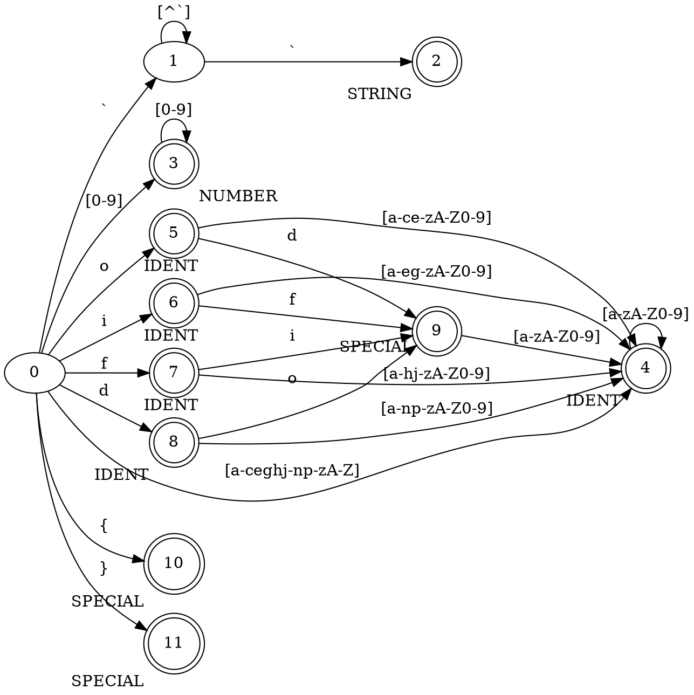

```dot
digraph G {
    rankdir=LR
    2 [xlabel="STRING"]
    3 [xlabel="NUMBER"]
    4 [xlabel="IDENT"]
    5 [xlabel="IDENT"]
    6 [xlabel="IDENT"]
    7 [xlabel="IDENT"]
    8 [xlabel="IDENT"]
    9 [xlabel="SPECIAL"]
    10 [xlabel="SPECIAL"]
    11 [xlabel="SPECIAL"]
    0 -> 1 [label="`"]
    1 -> 1 [label="[^`]"]
    1 -> 2 [label="`"]
    0, 3 -> 3 [label="[0-9]"]
    0 -> 4 [label="[a-ceghj-np-zA-Z]"]
    4, 9 -> 4 [label="[a-zA-Z0-9]"]
    0 -> 5 [label="o"]
    0 -> 6 [label="i"]
    0 -> 7 [label="f"]
    0 -> 8 [label="d"]
    5 -> 9 [label="d"]
    6 -> 9 [label="f"]
    7 -> 9 [label="i"]
    8 -> 9 [label="o"]
    5 -> 4 [label="[a-ce-zA-Z0-9]"]
    6 -> 4 [label="[a-eg-zA-Z0-9]"]
    7 -> 4 [label="[a-hj-zA-Z0-9]"]
    8 -> 4 [label="[a-np-zA-Z0-9]"]
    0 -> 10 [label="{"]
    0 -> 11 [label="}"]
    2, 3, 4, 5, 6, 7, 8, 9, 10, 11 [shape = doublecircle]
}
```
