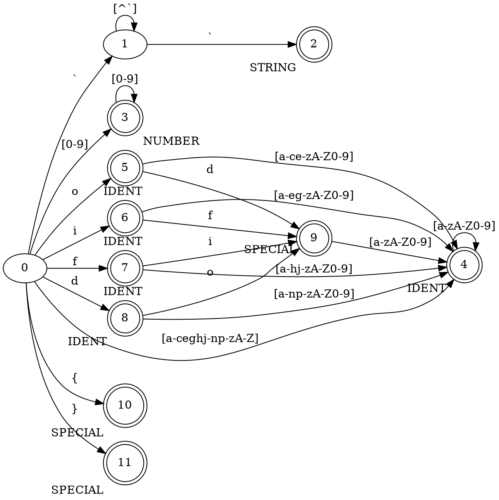

% Лабораторная работа № 1.4 «Лексический распознаватель»
% 25 марта 2024 г.
% Андрей Мельников, ИУ9-62Б

# Цель работы
Целью данной работы является изучение использования детерминированных конечных автоматов с размеченными
заключительными состояниями (лексических распознавателей) для решения задачи лексического анализа.

# Индивидуальный вариант
if, fi, do, od, {, }, строковые литералы ограничены обратными кавычками, могут пересекать границы строк 
текста.

# Реализация

Лексическая структура языка — регулярные выражения для доменов:

* NUMBER: [0-9]*
* SPECIAL: do|od|fi|if|}|{
* STRING: \`\[^\`]*\`
* IDENT: ([a-ceghj-np-zA-Z]|d[a-np-zA-Z0-9]|o[a-ce-zA-Z0-9]|f[a-hj-zA-Z0-9]|i[a-eg-zA-Z0-9])[a-zA-Z0-9]*|
  (do|od|fi|if)[a-zA-Z0-9]+

Граф детерминированного распознавателя:


Реализация распознавателя:

```python
from typing import Optional, NoReturn, List, Dict, Tuple
from lab1_3 import Position, Fragment, Message, Token
from copy import copy


class DFA:
    def __init__(
            self,
            n_states: int,
            final_states: Dict[int, str],
            transitions: Dict[Tuple[int, str],
            int]
    ) -> None:
        self.n_states = n_states
        self.final_states = final_states
        self.transitions = transitions
        self.last_final_state = 0
        self.current_state = 0

    def reset(self) -> NoReturn:
        self.current_state = 0
        self.last_final_state = 0

    def exist_transition(self, position: Position) -> bool:
        return (self.current_state, position.get_symbol()) in self.transitions

    def parse(self, position: Position) -> Token:
        self.reset()
        if position.is_end_of_file():
            return Token("END_OF_PROGRAM", copy(position), copy(position))
        value = list()
        start = copy(position)
        end = copy(position)
        while not position.is_end_of_file() and self.exist_transition(position):
            value.append(position.get_symbol())
            if self.current_state in self.final_states:
                self.last_final_state = self.current_state
            self.current_state = self.transitions[(self.current_state, position.get_symbol())]
            end = copy(position)
            position.next()
        if self.current_state in self.final_states:
            return Token(self.final_states[self.current_state], start, end, "".join(value))
        position.next()
        return Token("ERROR", end, end)


class Compiler:
    def __init__(self) -> None:
        self.messages = list()
        self.name_codes = dict()
        self.names = list()

    def add_name(self, name: str) -> int:
        if name in self.name_codes:
            return self.name_codes[name]
        code = len(self.name_codes)
        self.names.append(name)
        self.name_codes[name] = code
        return code

    def get_name(self, code: int) -> str:
        return self.names[code]

    def get_code(self, name: str) -> int:
        return self.name_codes[name]

    def add_message(
            self,
            position: Position,
            text: str
    ) -> NoReturn:
        self.messages.append(Message(position, text))

    def get_messages(self) -> List[str]:
        return self.messages

    def get_scanner(self, filename: str, dfa: DFA) -> 'Scanner':
        with open(filename, "r", encoding="UTF8") as f:
            text = f.readlines()
        text = [string.strip() for string in text]
        text = "\n".join(text)
        return Scanner(text, self, dfa)


class Scanner:
    def __init__(self, program: str, compiler: Compiler, dfa: Optional[DFA] = None) -> None:
        self.cur = Position(program)
        self.compiler = compiler
        self.comments = list()
        self.dfa = dfa

    def get_comments(self) -> List[Fragment]:
        return self.comments

    def get_next_token(self) -> Token:
        while not self.cur.is_end_of_file() and self.cur.is_white_space():
            self.cur.next()
        token = self.dfa.parse(self.cur)
        if token.tag == "IDENT":
            self.compiler.add_name(token.value)
            token.value = self.compiler.get_code(token.value)
        if token.tag == "NUMBER":
            token.value = int(token.value)
        return token

    def tokenize(self) -> NoReturn:
        token = self.get_next_token()
        self.comments.append(token)
        while token.get_tag() != "END_OF_PROGRAM":
            token = self.get_next_token()
            self.comments.append(token)


def create_dfa() -> DFA:
    n_states = 12
    final_states = {
        2: "STRING",
        3: "NUMBER",
        4: "IDENT",
        5: "IDENT",
        6: "IDENT",
        7: "IDENT",
        8: "IDENT",
        9: "SPECIAL",
        10: "SPECIAL",
        11: "SPECIAL"
    }
    transitions = dict()
    for i, c in enumerate("oifd"):
        transitions[(0, c)] = 5 + i
    for i, c in enumerate("dfio"):
        transitions[(5 + i, c)] = 9
    numbers = set([str(i) for i in range(10)])
    letters = set([chr(i) for i in range(ord("a"), ord("z") + 1)] +
                  [chr(i) for i in range(ord("A"), ord("Z") + 1)])
    for i, c in enumerate("dfio"):
        for x in letters - set(c):
            transitions[(5 + i, x)] = 4
    for c in letters - set("dfio"):
        transitions[(0, c)] = 4
    for c in letters | numbers:
        transitions[(4, c)] = 4
    for c in numbers:
        transitions[(0, c)] = 3
    for c in numbers:
        transitions[(3, c)] = 3
    transitions[(0, "`")] = 1
    for i in range(65535):
        c = chr(i)
        if c != "`":
            transitions[(1, c)] = 1
    for c in letters | numbers:
        transitions[(9, c)] = 4
    transitions[(1, "`")] = 2
    transitions[(0, "{")] = 10
    transitions[(0, "}")] = 11
    return DFA(n_states, final_states, transitions)


def main() -> NoReturn:
    filename = "test1_4.txt"
    compilier = Compiler()
    dfa = create_dfa()
    scanner = compilier.get_scanner(filename, dfa)
    scanner.tokenize()
    for token in scanner.get_comments():
        print(token)


if __name__ == "__main__":
    main()
```

# Тестирование

Входные данные

```
dqeq qrgf 123 -12312 if If FI fi od Do dqeq 1312312 `grgeqeg
     reqgfef  `

qwfwq 10{final}100
```

Вывод на `stdout`

```
(1, 1)-(1, 4) IDENT 0
(1, 6)-(1, 9) IDENT 1
(1, 11)-(1, 13) NUMBER 123
(1, 15)-(1, 15) ERROR 
(1, 16)-(1, 20) NUMBER 12312
(1, 22)-(1, 23) SPECIAL if
(1, 25)-(1, 26) IDENT 2
(1, 28)-(1, 29) IDENT 3
(1, 31)-(1, 32) SPECIAL fi
(1, 34)-(1, 35) SPECIAL od
(1, 37)-(1, 38) IDENT 4
(1, 40)-(1, 43) IDENT 0
(1, 45)-(1, 51) NUMBER 1312312
(1, 53)-(2, 10) STRING `grgeqeg
reqgfef  `
(4, 1)-(4, 5) IDENT 5
(4, 7)-(4, 8) NUMBER 10
(4, 9)-(4, 9) SPECIAL {
(4, 10)-(4, 14) IDENT 6
(4, 15)-(4, 15) SPECIAL }
(4, 16)-(4, 18) NUMBER 100
(4, 19)-(4, 19) END_OF_PROGRAM 
```

# Вывод
В ходе выполнения данной лабораторной работы было изучено использование детерминированных конечных автоматов
с размеченными заключительными состояниями для решения задачи лексического анализа, а также реализован ДКА 
для лексического анализатора языка из индивидуального варианта.
